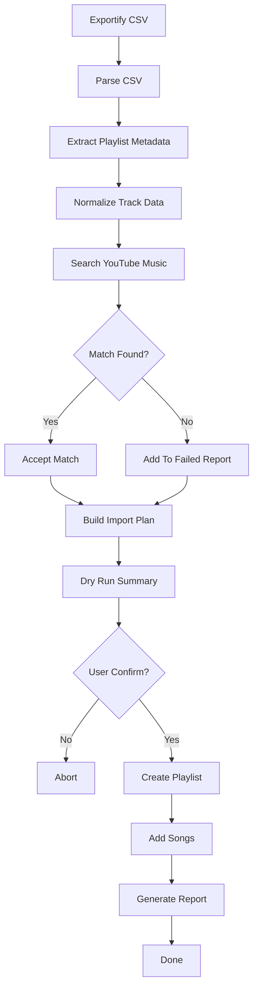

# ytmusic-importer

[](https://pypi.org/project/ytmusic-importer/)
[](https://www.python.org/)
[](LICENSE)

Import Spotify playlists into YouTube Music without using the Spotify API.

A lightweight command-line tool that reads playlist exports from Exportify and recreates them in YouTube Music using `ytmusicapi`.

---

## Why This Exists

Most playlist migration services are:

- Paid
- Rate limited
- Closed source
- Require account linking

Tools like TuneMyMusic work well, but free plans are often limited by playlist size or monthly quotas.

`ytmusic-importer` takes a different approach:

- Export your playlist as CSV
- Run a local command
- Create the playlist directly in your YouTube Music account

No Spotify API keys required.

---

## Features

### Current

- Import Exportify CSV files
- Automatic playlist creation
- Automatic song searching
- Batch processing
- Resume interrupted imports
- Failed song reporting
- Linux-friendly CLI workflow

### Planned

- Match confidence scoring
- Interactive review mode
- Search result caching
- Multiple playlist imports
- FastAPI backend
- Web UI
- Docker support

---

## Installation

### PyPI

```bash
pip install ytmusic-importer
```

### pipx

```bash
pipx install ytmusic-importer
```

### Development Install

```bash
git clone https://github.com/Cleign1/spotify-to-ytm.git

cd spotify-to-ytm

## use venv
pip install -e .
```

---

## Authentication

This project uses `ytmusicapi`, an unofficial YouTube Music API wrapper. It authenticates using your browser session. :contentReference[oaicite:0]{index=0}

Generate a browser authentication file:

```bash
ytmusicapi browser
```

This creates:

```text
browser.json
```

which is used to authenticate playlist operations. Browser-based authentication is documented by ytmusicapi and typically remains valid as long as the underlying browser session remains active. :contentReference[oaicite:1]{index=1}

---

## Exporting Spotify Playlists

This tool is designed around Exportify.

1. Open Exportify
2. Export a playlist as CSV
3. Save the file

Example:

```text
This Is James Blake.csv
```

---

## Quick Start

```bash
ytmusic-import playlist.csv
```

The playlist name will automatically be derived from the filename.

Example:

```bash
ytmusic-import "This Is James Blake.csv"
```

Creates:

```text
This Is James Blake
```

inside YouTube Music.

---

## How It Works



---

## CLI Usage

### Basic

```bash
ytmusic-import playlist.csv
```

### Custom Playlist Name

```bash
ytmusic-import playlist.csv \
  --playlist "Road Trip Mix"
```

### Resume Import

```bash
ytmusic-import playlist.csv \
  --resume
```

### Custom Authentication File

```bash
ytmusic-import playlist.csv \
  --auth browser.json
```

---

## Commands

### Import

```bash
ytmusic-import playlist.csv
```

Import a playlist into YouTube Music.

### Dry Run

```bash
ytmusic-import playlist.csv --dry-run
```

Preview the migration without creating a playlist.

### Resume

```bash
ytmusic-import playlist.csv --resume
```

Continue from the previous checkpoint.

---

## Project Structure

```text
spotify-to-ytm/

├── pyproject.toml
├── README.md
├── LICENSE
│
├── ytmusic_importer/
│   │
│   ├── __init__.py
│   ├── cli.py
│   │
│   ├── models/
│   │   ├── track.py
│   │   ├── playlist.py
│   │   └── match.py
│   │
│   ├── parsers/
│   │   └── exportify.py
│   │
│   ├── services/
│   │   ├── search_service.py
│   │   ├── matching_service.py
│   │   ├── playlist_service.py
│   │   ├── report_service.py
│   │   └── import_service.py
│   │
│   ├── repositories/
│   │   ├── cache_repository.py
│   │   └── checkpoint_repository.py
│   │
│   ├── clients/
│   │   └── ytmusic_client.py
│   │
│   ├── reports/
│   │   └── writer.py
│   │
│   └── utils/
│       ├── strings.py
│       ├── files.py
│       └── logging.py
│
├── tests/
│   ├── test_parser.py
│   ├── test_search.py
│   ├── test_matching.py
│   └── test_import.py
│
├── cache/
├── data/
└── examples/
```

---

## Output Files

| File | Purpose |
|--------|--------|
| checkpoint.json | Resume state |
| failed.txt | Unmatched songs |
| report.json | Import summary |
| processed_csv/*.csv | Normalized playlist data |

---

## Example Output

```text
Playlist: This Is James Blake

Tracks Found: 197
Tracks Missing: 3
Match Rate: 98.5%

Creating playlist...
Adding tracks...

Import complete.
```

---

## Limitations

- Matching is best-effort
- Search results may occasionally select the wrong version of a song
- Relies on an unofficial API
- YouTube Music internal changes can occasionally break functionality


---

## Contributing

Contributions are welcome.

Ideas:

- Better matching algorithms
- Performance improvements
- FastAPI endpoints
- Documentation improvements
- Test coverage

Open an issue or submit a pull request.

---

## Acknowledgements

This project is built on top of ytmusicapi, an unofficial Python client for YouTube Music. The library provides playlist management, search functionality, and authentication support used throughout this project.

---

## License

MIT License.